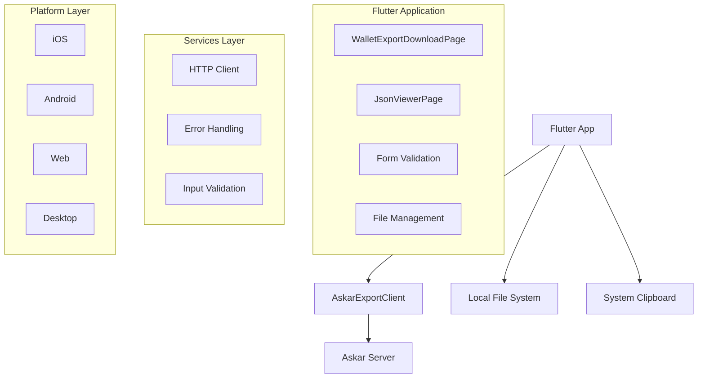
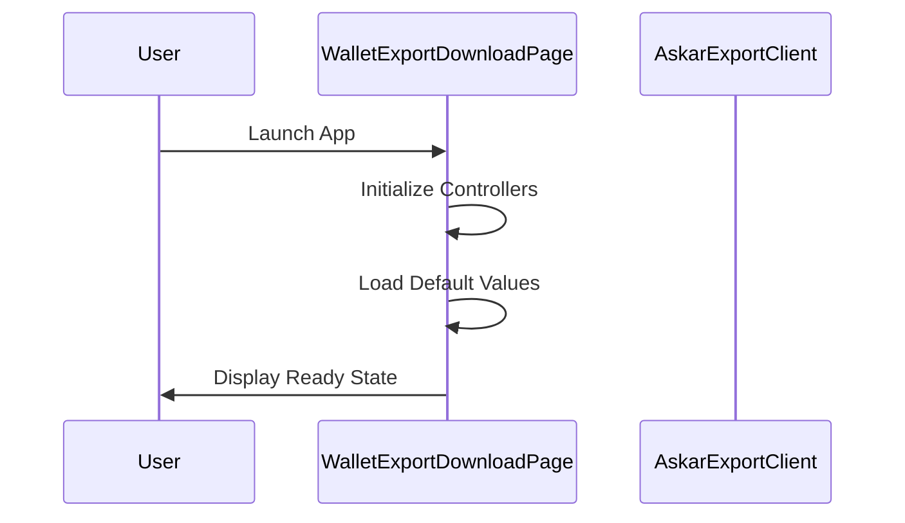
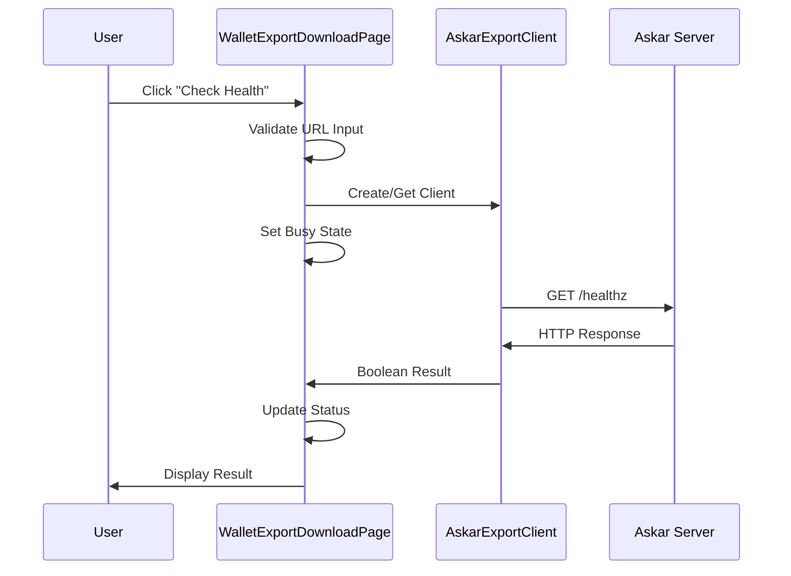
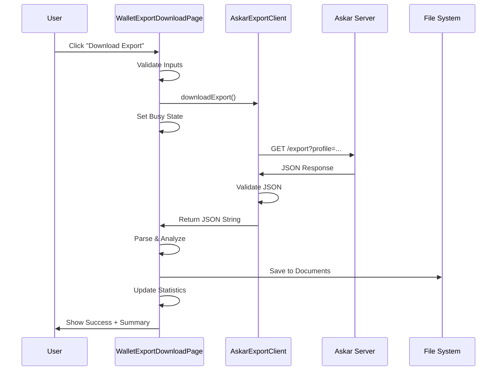
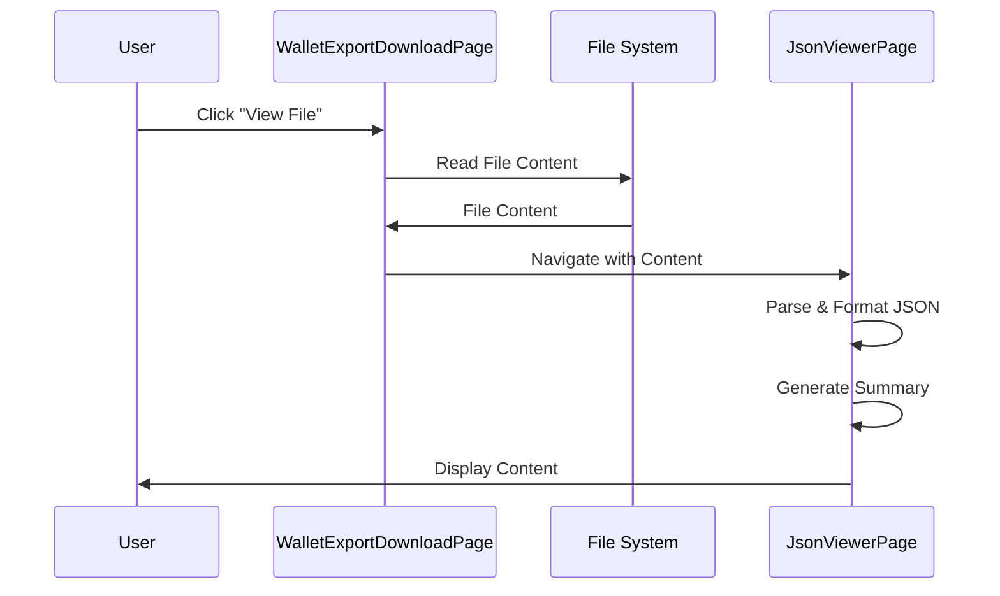

# Architecture & Technical Documentation
## Askar Import Flutter Application

### Table of Contents
1. [System Architecture](#system-architecture)
2. [Component Design](#component-design)
3. [API Specification](#api-specification)
4. [Data Flow](#data-flow)
5. [Security Architecture](#security-architecture)
6. [Performance Considerations](#performance-considerations)
7. [Error Handling Strategy](#error-handling-strategy)
8. [Testing Strategy](#testing-strategy)
9. [Deployment Architecture](#deployment-architecture)
10. [Code Quality & Standards](#code-quality--standards)

---

## System Architecture

### High-Level Architecture



### Technology Stack

| Layer | Technology | Purpose |
|-------|------------|---------|
| **Frontend** | Flutter 3.9.2+ | Cross-platform UI framework |
| **Language** | Dart 3.9.2+ | Programming language |
| **HTTP Client** | dart:io + http package | Network communication |
| **File System** | path_provider package | Local file operations |
| **State Management** | StatefulWidget | Local component state |
| **JSON Processing** | dart:convert | JSON parsing/encoding |
| **Clipboard** | flutter/services | System clipboard access |

### Platform Targets

- **Mobile**: iOS 11+, Android API 21+
- **Desktop**: macOS 10.14+, Windows 10+, Linux (GTK 3.0+)
- **Web**: Modern browsers (Chrome, Firefox, Safari, Edge)

---

## Component Design

### 1. AskarExportClient

**Location**: `lib/services/askar_export_client.dart`

**Responsibilities**:
- HTTP communication with Askar servers
- Request/response handling and validation
- Custom exception management
- Resource lifecycle management

**Key Methods**:

```dart
class AskarExportClient {
  // Constructor with URL validation
  AskarExportClient(String baseUrl, {http.Client? httpClient});
  
  // Health check endpoint
  Future<bool> healthz();
  
  // Export download with comprehensive error handling
  Future<String> downloadExport({
    required String profile,
    bool pretty = false,
  });
  
  // Resource cleanup
  void dispose();
}
```

**Error Handling**:
- Custom `AskarExportException` with status codes
- Network-specific error categorization
- Input validation and sanitization
- Timeout management (8s health, 30s download)

### 2. WalletExportDownloadPage

**Location**: `lib/ui/pages/wallet_export_download_page.dart`

**Responsibilities**:
- Main user interface and interaction handling
- Form validation and user input management
- File operations and clipboard integration
- Progress tracking and status updates

**State Management**:

```dart
class _WalletExportDownloadPageState extends State<WalletExportDownloadPage> {
  // Form controllers
  final TextEditingController _serverCtrl;
  final TextEditingController _profileCtrl;
  final GlobalKey<FormState> _formKey;
  
  // Application state
  bool _busy;
  String _status;
  String? _savedPath;
  int _categoryCount;
  int _recordCount;
  AskarExportClient? _client;
}
```

**Key Features**:
- Real-time form validation
- Clipboard integration (⌘+V support)
- File management (view, delete, browse)
- Progress indicators and status feedback

### 3. JsonViewerPage

**Location**: `lib/ui/pages/json_viewer_page.dart`

**Responsibilities**:
- JSON content visualization and analysis
- Export statistics and summaries
- Content copying and file information
- Responsive layout management

**Features**:
- Toggle between formatted and raw JSON
- Export summary with category breakdown
- Horizontal/vertical scrolling for large content
- Clipboard integration for content copying

---

## API Specification

### Askar Server Endpoints

#### Health Check
```http
GET /healthz
```

**Response**:
- `200 OK`: Server is healthy
- `Non-200`: Server unavailable

#### Export Download
```http
GET /export?profile={profile}&pretty={boolean}&download=false
```

**Parameters**:
- `profile` (required): Profile/tenant identifier
- `pretty` (optional): Format JSON output (default: false)
- `download` (optional): Force download vs inline (fixed: false)

**Responses**:
- `200 OK`: Export data in JSON format
- `400 Bad Request`: Invalid parameters
- `401 Unauthorized`: Authentication required
- `403 Forbidden`: Access denied
- `404 Not Found`: Profile not found
- `500 Internal Server Error`: Server error

**Response Format**:
```json
{
  "category1": [
    { "record": "data" },
    { "record": "data" }
  ],
  "category2": [
    { "record": "data" }
  ]
}
```

---

## Data Flow

### 1. Application Startup



### 2. Health Check Flow



### 3. Export Download Flow



### 4. File Viewing Flow



---

## Security Architecture

### 1. Network Security

**HTTPS Support**:
- Full support for TLS/SSL connections
- Certificate validation using system store
- Configurable for development HTTP endpoints

**URL Validation**:
```dart
String? _validateUrl(String? value) {
  final uri = Uri.tryParse(value?.trim() ?? '');
  if (uri == null || !uri.hasScheme || !uri.hasAuthority) {
    return 'Invalid URL format';
  }
  if (!['http', 'https'].contains(uri.scheme.toLowerCase())) {
    return 'Only HTTP/HTTPS protocols supported';
  }
  return null;
}
```

### 2. Input Validation

**Profile Name Sanitization**:
```dart
String? _validateProfile(String? value) {
  final trimmed = value?.trim() ?? '';
  if (trimmed.isEmpty) return 'Profile name required';
  if (trimmed.length < 2) return 'Minimum 2 characters';
  if (trimmed.contains(RegExp(r'[<>:"/\\|?*]'))) {
    return 'Invalid characters detected';
  }
  return null;
}
```

**File Path Sanitization**:
```dart
final sanitizedProfile = profile.replaceAll(RegExp(r'[^\w\-_]'), '_');
final filename = 'askar_export_${sanitizedProfile}_$timestamp.json';
```

### 3. Error Information Disclosure

**Safe Error Messages**:
- Generic user-facing error messages
- Detailed errors logged internally
- No sensitive data in error strings
- Status code mapping for common scenarios

```dart
switch (response.statusCode) {
  case 404:
    throw AskarExportException('Profile not found', statusCode: 404);
  case 401:
    throw AskarExportException('Authentication required', statusCode: 401);
  case 403:
    throw AskarExportException('Access denied', statusCode: 403);
  default:
    throw AskarExportException('Request failed', statusCode: response.statusCode);
}
```

### 4. File System Security

**Secure Storage**:
- Files stored in application documents directory
- Platform-specific security (iOS App Sandbox, Android app-private storage)
- No world-readable file permissions

**Path Validation**:
- All file operations within app directory
- No path traversal vulnerabilities
- Filename sanitization prevents injection

---

## Performance Considerations

### 1. Network Optimization

**Timeout Configuration**:
- Health check: 8 seconds
- Export download: 30 seconds
- Prevents hanging connections

**HTTP Client Management**:
```dart
AskarExportClient _getClient() {
  if (_client == null || _client!.baseUrl != serverUrl) {
    _client?.dispose();  // Cleanup previous client
    _client = AskarExportClient(serverUrl);
  }
  return _client!;
}
```

### 2. Memory Management

**Large File Handling**:
- Streaming JSON processing for large exports
- Lazy loading in JSON viewer
- Proper disposal of resources

**Widget Lifecycle**:
```dart
@override
void dispose() {
  _serverCtrl.dispose();
  _profileCtrl.dispose();
  _client?.dispose();
  super.dispose();
}
```

### 3. UI Performance

**Responsive Layout**:
- Flexible widgets prevent overflow
- Scrollable content areas
- Efficient ListView builders

**State Updates**:
- Minimal widget rebuilds
- Efficient state management
- Debounced user input validation

---

## Error Handling Strategy

### 1. Exception Hierarchy

```dart
class AskarExportException implements Exception {
  final String message;
  final int? statusCode;
  final dynamic originalError;
  
  AskarExportException(this.message, {this.statusCode, this.originalError});
}
```

### 2. Error Categories

| Category | Examples | User Message | Action |
|----------|----------|--------------|--------|
| **Network** | SocketException, TimeoutException | "Connection failed" | Retry, check connectivity |
| **HTTP** | 4xx, 5xx status codes | "Server error" | Contact support |
| **Validation** | Invalid input | Specific field error | Correct input |
| **File System** | Permission, disk space | "File operation failed" | Check storage |
| **JSON** | Parse errors | "Invalid data format" | Re-download |

### 3. Recovery Strategies

**Automatic Retry**:
- Network timeouts with exponential backoff
- Transient error detection
- User-initiated retry for permanent failures

**Graceful Degradation**:
- Partial data display when possible
- Alternative workflows for blocked features
- Clear error state indication

---

## Testing Strategy

### 1. Unit Tests

**AskarExportClient**:
```dart
testWidgets('should validate URL format', (tester) async {
  expect(
    () => AskarExportClient('invalid-url'),
    throwsA(isA<ArgumentError>()),
  );
});

testWidgets('should handle network errors', (tester) async {
  final mockClient = MockHttpClient();
  when(mockClient.get(any)).thenThrow(SocketException(''));
  
  final client = AskarExportClient('http://test.com', httpClient: mockClient);
  expect(
    client.healthz(),
    throwsA(isA<AskarExportException>()),
  );
});
```

**Validation Logic**:
```dart
testWidgets('should validate profile names', (tester) async {
  final page = WalletExportDownloadPageState();
  
  expect(page.validateProfile(''), isNotNull);
  expect(page.validateProfile('a'), isNotNull);
  expect(page.validateProfile('valid-profile'), isNull);
  expect(page.validateProfile('invalid/profile'), isNotNull);
});
```

### 2. Widget Tests

**UI Component Testing**:
```dart
testWidgets('should display form fields', (tester) async {
  await tester.pumpWidget(MaterialApp(home: WalletExportDownloadPage()));
  
  expect(find.text('Server URL'), findsOneWidget);
  expect(find.text('Profile (sub-wallet) name'), findsOneWidget);
  expect(find.text('Check Health'), findsOneWidget);
  expect(find.text('Download Export JSON'), findsOneWidget);
});

testWidgets('should accept text input', (tester) async {
  await tester.pumpWidget(MaterialApp(home: WalletExportDownloadPage()));
  
  await tester.enterText(find.byType(TextFormField).first, 'http://test.com');
  await tester.enterText(find.byType(TextFormField).last, 'test-profile');
  
  expect(find.text('http://test.com'), findsOneWidget);
  expect(find.text('test-profile'), findsOneWidget);
});
```

### 3. Integration Tests

**End-to-End Scenarios**:
- Complete download workflow
- Error handling scenarios
- File management operations
- Cross-platform compatibility

### 4. Performance Tests

**Load Testing**:
- Large JSON file handling
- Memory usage profiling
- UI responsiveness under load

---

## Deployment Architecture

### 1. Build Configuration

**Platform-Specific Builds**:
```yaml
# iOS Configuration
ios:
  deployment_target: '11.0'
  
# Android Configuration
android:
  minSdkVersion: 21
  targetSdkVersion: 34
  
# Web Configuration
web:
  canvaskit: true
```

**Build Commands**:
```bash
# Development
flutter run --debug

# Production
flutter build apk --release --obfuscate --split-debug-info=build/debug-info
flutter build ios --release --obfuscate --split-debug-info=build/debug-info
flutter build web --release --web-renderer canvaskit
```

### 2. CI/CD Pipeline

**Automated Testing**:
```yaml
# Example GitHub Actions
- name: Run Tests
  run: |
    flutter test
    flutter test integration_test/
    
- name: Build APK
  run: flutter build apk --release
  
- name: Upload Artifacts
  uses: actions/upload-artifact@v3
```

### 3. Distribution

**App Stores**:
- Google Play Store (Android)
- Apple App Store (iOS/macOS)
- Microsoft Store (Windows)
- Web hosting (Firebase/GitHub Pages)

---

## Code Quality & Standards

### 1. Linting Configuration

**Analysis Options** (`analysis_options.yaml`):
```yaml
include: package:flutter_lints/flutter.yaml

linter:
  rules:
    prefer_single_quotes: true
    prefer_const_constructors: true
    avoid_empty_else: true
    cancel_subscriptions: true
    close_sinks: true
    prefer_final_fields: true
    avoid_web_libraries_in_flutter: true
```

### 2. Code Style Guidelines

**Naming Conventions**:
- Classes: `PascalCase`
- Methods/Variables: `camelCase`
- Files: `snake_case.dart`
- Constants: `SCREAMING_SNAKE_CASE`

**Documentation**:
```dart
/// Downloads export with comprehensive error handling and validation
/// 
/// Throws [AskarExportException] for various error conditions:
/// - Network connectivity issues
/// - Invalid server responses
/// - Profile not found (404)
/// - Access denied (403)
/// 
/// Returns the raw JSON string for processing by the caller.
Future<String> downloadExport({
  required String profile,
  bool pretty = false,
}) async {
  // Implementation
}
```

### 3. Dependency Management

**Version Pinning**:
```yaml
dependencies:
  flutter: sdk: flutter
  cupertino_icons: ^1.0.8  # Minor updates allowed
  http: ^1.5.0             # Minor updates allowed
  path_provider: ^2.1.5    # Minor updates allowed
```

**Security Updates**:
- Regular dependency auditing
- Automated security vulnerability scanning
- Controlled update process

---

## Conclusion

This architecture provides a robust, scalable foundation for the Askar Import application with emphasis on:

- **Security**: Input validation, secure communication, safe error handling
- **Performance**: Efficient resource management, responsive UI, optimized networking
- **Maintainability**: Clear separation of concerns, comprehensive testing, quality tooling
- **Reliability**: Comprehensive error handling, graceful degradation, proper lifecycle management

The modular design allows for easy extension in Phase 2 (import functionality) while maintaining backward compatibility and code quality standards.